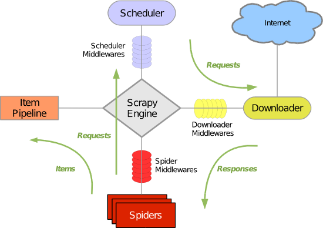

##什么是scrapy
    爬虫中封装好的一个明星框架。
##包含功能
- 高性能的持久化操作
- 异步的数据下载
- 高性能的数据解析
- 分布式

##环境安装
- linux or mac ：pip install scrapy
- window ：pycharm 安装Twisted、pywin32、scrapy

##基本使用
- scrapy startproject xxxPro
- 在spiders子目录中创建一个爬虫文件(子文件夹下)
> scrapy genspider spiderName www.xxx.com
- 在spiderName文件中编写功能代码(后面说)
- 执行工程
> scrapy crawl spiderName

##settings.py中常用配置
```python
ROBOTSTXT_OBEY = False #不遵循robots协议
LOG_LEVEL = 'ERROR' #只打印错误日志信息
```

##scrapy数据解析


##scrapy持久化存储
###基于终端指令
1. 要求：`只可以将parse方法的返回值存储到本地的文本文件中`
2. 持久化存储对应的文本文件类型只有如下几种：
'json', 'jsonlines', 'jl', 'csv', 'xml', 'marshal', 'pickle'
3.指令：scrapy crawl xxx -o filePath
4.好处：简洁高效便捷
5.缺点：局限性较强（数据只可以存储到指定后缀的文本文件中）
   
###基于管道
- 编码流程：
  1. 数据解析
  2. 在item中定义相关属性  
  3. 将解析的数据封装到item类型的对象
  4. 将item类型的对象提交给管道进行持久化存储的操作
  5. 在管道类的process_item中要将接收到的item对象中存储的数据进行持久化UC你很粗
  6. 在配置文件中开启管道
- 好处：通用性强
- 缺点：代码编写繁琐

- 注意事项
1. 管道文件中一个管道类对应的是将数据存储到一种平台
2. 爬虫提交的item只会给管道文件中的第一个被执行的管道类接受
3. process_item中return item 表示将item传递给下一个即将被执行的管道类

##基于Spider的全站数据爬取
- 就是将网站中某板块下的全部页面对应的页面数据进行爬取

- 需求：爬取校花网的照片的名称
- 实现方式
1. 将所有页面的url添加到start_urls列表中（不推荐）
2. 自行手动进行请求发送（推荐）
```python
# parse中
yield scrapy.Request(url, callback) #callback专门用于做数据解析
```

##五大核心组件

- 引擎(Scrapy)
用来处理整个系统的数据流处理, 触发事务(框架核心)
- 调度器(Scheduler)
用来接受引擎发过来的请求, 压入队列中, 并在引擎再次请求的时候返回. 可以想像成一个URL（抓取网页的网址或者说是链接）的优先队列, 由它来决定下一个要抓取的网址是什么, 同时去除重复的网址
- 下载器(Downloader)
用于下载网页内容, 并将网页内容返回给蜘蛛(Scrapy下载器是建立在twisted这个高效的异步模型上的)
- 爬虫(Spiders)
爬虫是主要干活的, 用于从特定的网页中提取自己需要的信息, 即所谓的实体(Item)。用户也可以从中提取出链接,让Scrapy继续抓取下一个页面
- 项目管道(Pipeline)
负责处理爬虫从网页中抽取的实体，主要的功能是持久化实体、验证实体的有效性、清除不需要的信息。当页面被爬虫解析后，将被发送到项目管道，并经过几个特定的次序处理数据。

##请求传参
- 使用场景：如果要爬取解析的数据不在同一张页面。（深度爬取）
- 需求：爬取boss直聘的岗位名称，岗位描述。

- 遇到问题：
1. cookie：解决方法 在setting中解除cookie注释，再把浏览器cookie加进去
```python
# Disable cookies (enabled by default)
COOKIES_ENABLED = False
# ....
DEFAULT_REQUEST_HEADERS = {
  'Accept': 'text/html,application/xhtml+xml,application/xml;q=0.9,*/*;q=0.8',
  'Accept-Language': 'en',
  'Cookie': 'lastCity=100010000; __g=-; Hm_lvt_194df3105ad7148dcf2b98a91b5e727a=1613118899; __fid=6653a1a0c09ec84a2386c47aaae4b417; JSESSIONID=""; __l=l=%2Fwww.zhipin.com%2Fjob_detail%2F0d23491c5f80797e1nV-39y5FVFW.html&r=&g=&s=3&friend_source=0&s=3&friend_source=0; ___gtid=-2142700149; __c=1613118899; __a=89402913.1585148145.1609079009.1613118899.89.4.10.89; Hm_lpvt_194df3105ad7148dcf2b98a91b5e727a=1613120959; __zp_stoken__=ff57bEEonMz5NTX9rXThkeHJGI18%2BNHU2FH5WfXNNaQ1JNwMbbGI6DVViczlrLWU%2FNh81V347XTZAPSUPByZnVSB%2FVXESS25kTCcJblY6QQN0CiAwHl5CQjkbE1JiTBhXME4%2Fbm0bIDw0QG1sBw%3D%3D; __zp_sseed__=jpuNwYZguTlr2vLmn+UkTgatnPrzywm+Tf2Csl30/1s=; __zp_sname__=eb1c0b1e; __zp_sts__=1613120965775',
}
```
2. boss网站反爬机制较多，测试困难

##图片数据爬取之ImagesPipeline
###基于scrapy爬取字符串类型数据和图片类型数据的区别
- 字符串：只需要xpath进行解析且提交管道进行持久化存储
- 图片：xpath解析图片的src的属性值，单独对图片地址发起请求获取图片二进制数据
###InagePipeline作用:
只需要将img的属性值进行解析，提交到管道当中，管道就回对图片的src的进行请求发送获取图片
的二进制类型的数据，且还会帮我们进行持久化存储。
###
###需求：爬取站长素材中的高清图片->使用流程
- 数据解析（图片的地址）
- 将存储图片地址的item提交到指定的管道类
- 重写管道类中的方法
1. get_media_requests(self, item, info)
2. file_path(self, request, response, info=None, *, item=None)
3. item_completed(self, results, item, info)
- 在配置文件中
1. 指定图片存储的目录：IMAGES_STORE = './images/'
2. 指定开启的管道：自定制的管道

##中间件
###位置
- 引擎和下载器之间的成为下载中间件
- 引擎和爬虫之间的中间件为爬虫中间件

###下载中间件
- 作用：批量拦截到整个工程中发起的所有的请求和响应
- 拦截请求
1. UA伪装(配置文件中的UA伪装是全局的：process_request中设定
2. 代理IP ： process_exception中设定（return request）
- 拦截响应：
1. 篡改响应数据，响应对象

##中间件测试需求
> 需求：爬取网易新闻中的网页数据（标题和内容）
- 通过网易新闻的首页解析出五大板块对应的详情页url（没有动态加载）
- 每一个板块对应的新闻标题都是动态加载出来的（动态加载）
- 通过解析出每一条新闻详情页的url获取的详情页的页面源码，解析出新闻内容


